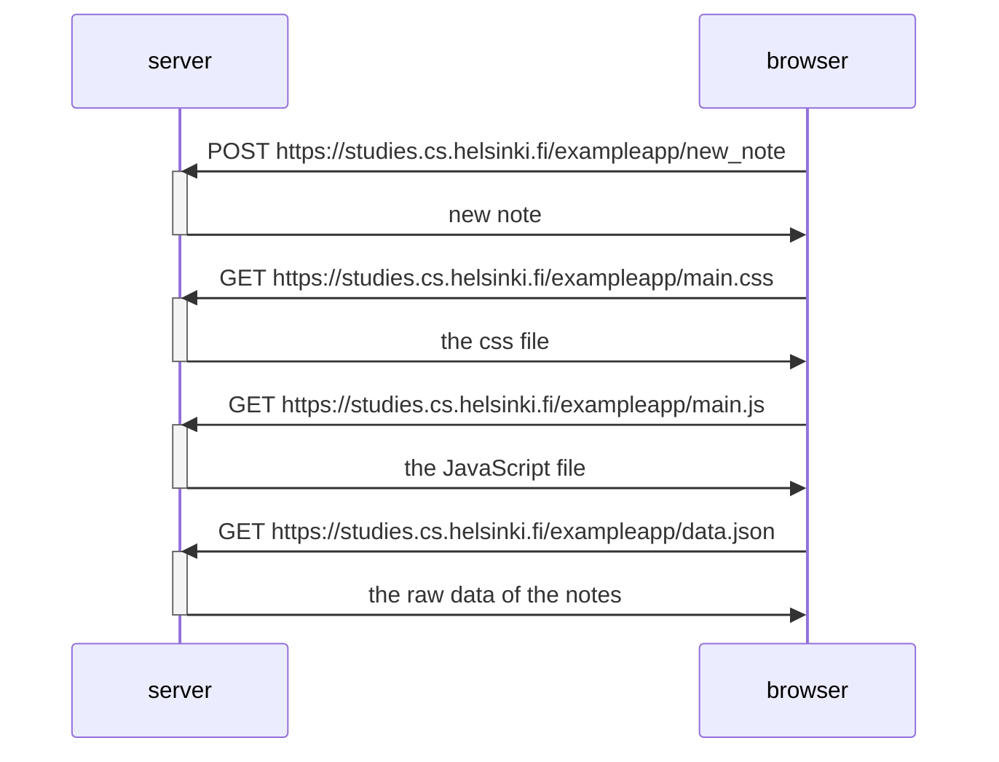

```mermaid
sequenceDiagram

participant server
participant browser

browser->>server: POST https://studies.cs.helsinki.fi/exampleapp/new_note
activate server
server->>browser: new note
deactivate server

browser->>server: GET https://studies.cs.helsinki.fi/exampleapp/main.css
activate server
server->>browser: the css file
deactivate server

browser->>server: GET https://studies.cs.helsinki.fi/exampleapp/main.js
activate server
server->>browser: the JavaScript file
deactivate server

browser->>server: GET https://studies.cs.helsinki.fi/exampleapp/data.json
activate server
server->>browser: the raw data of the notes
deactivate server

```